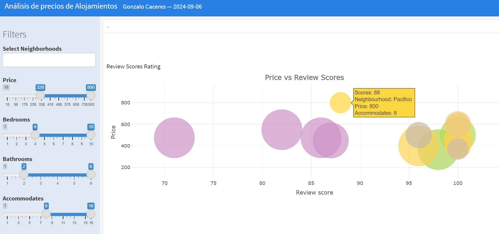
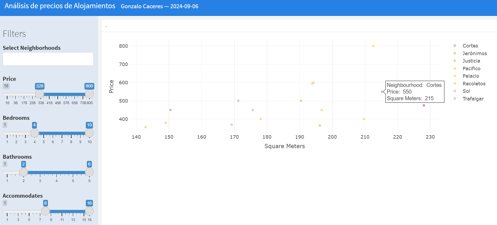
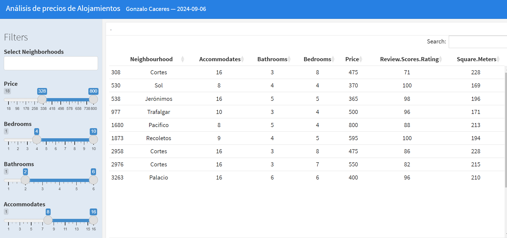

# Análisis de Precios de Alojamientos

Este proyecto presenta un cuadro de mando interactivo para analizar los precios de alojamiento.
Desarrollado en R utilizando flexdashboard, este dashboard ofrece una visión completa y dinámica del mercado inmobiliario local.

Características principales

•	Visualizaciones interactivas de precios por vecindario
•	Análisis de la relación entre puntuaciones de reseñas y precios
•	Exploración de la correlación entre tamaño del alojamiento y precio
•	Filtros dinámicos para una exploración personalizada de los datos

Uso de los filtros

El dashboard incluye varios filtros interactivos que permiten a los usuarios personalizar su análisis:
1.	Selección de Vecindarios: Permite elegir uno o múltiples vecindarios para comparar.
2.	Rango de Precios: Ajusta el rango de precios para enfocarse en alojamientos específicos.
3.	Número de Dormitorios: Filtra los alojamientos según la cantidad de dormitorios.
4.	Número de Baños: Selecciona alojamientos basados en la cantidad de baños.
5.	Capacidad de Alojamiento: Ajusta el número de personas que el alojamiento puede acomodar.
   
Estos filtros afectan a todas las visualizaciones simultáneamente, permitiendo un análisis detallado y específico.

Visualizaciones

1.	Precio vs Vecindario: Diagrama de barras que muestra la distribución de precios para cada vecindario.
Esta visualización permite ver:
•	La variación de precios dentro de cada vecindario.
•	Comparar la distribución de precios entre diferentes vecindarios.
•	Identificar vecindarios con alojamientos más caros o más baratos.
•	Detectar posibles valores atípicos (alojamientos con precios muy altos o muy bajos) en cada vecindario.

2.	Puntuación de Reseñas vs Precio: Un gráfico de dispersión que muestra la calificación de reseñas en el eje x, el precio en el eje y, y el tamaño de los puntos representa la capacidad de alojamiento.

3.	Precio vs Metros Cuadrados: Gráfico dispersión que muestra los metros cuadrados en el eje x y el precio en el eje y, con colores que representan diferentes vecindarios.

4.	Tabla de Datos: Una tabla interactiva que muestra el conjunto de datos filtrado, permitiendo a los usuarios explorar la información en detalle..

[Ver Cuadro de Mando](https://gonzalocaceres2004.github.io/Dashboard-de-Alojamientos/Dashboard.html)

Se muestran imágenes de ejemplo

